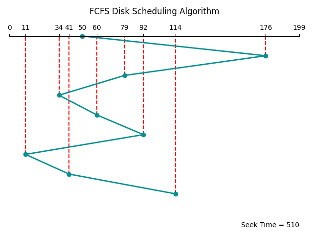

## Disk-Scheduling-Algorithms

**Disk Scheduling Algorithm** is an algorithm that keeps and manages input and output requests arriving for the disk in a system.

### Types of Disk Scheduling Algorithm in OS

<p align = center>
    
</p>

### Test Cases and Plots
The following example is used as input for all the disk scheduling algorithms:

The Disc has 200 Tracks. Request sequence is **{176, 79, 34, 60, 92, 11, 41, 114}** and the Initial head position is **50**.
The head is moving towards **Right** direction.

|                       |                       |
|------------------------------------------------|------------------------------------------------|
| <p align = center>*FCFS Disk Scheduling*</p>   | <p align = center>*SSTF Disk Scheduling*</p>   |
|                       |                       |
| <p align = center>*SCAN Disk Scheduling*</p>   | <p align = center>*LOOK Disk Scheduling*</p>   |
|                   |                   |
| <p align = center>*C-SCAN Disk Scheduling*</p> | <p align = center>*C-LOOK Disk Scheduling*</p> |


### Requirements
This project uses an external library called Matplotlib for plotting the Request Sequence. It can be installed be executing the following command:

```shell
pip install matplotlib
```